# AI Audit & Compliance Assistant — Enterprise Architecture Document

**Version:** 1.0.0  
**Classification:** Internal — Engineering  
**Last Updated:** 2026-05-29  
**Authors:** Platform Engineering Team  
**Status:** Production Architecture Reference

---

## Table of Contents

1. [Executive Summary](#1-executive-summary)
2. [System Overview](#2-system-overview)
3. [High-Level Design (HLD)](#3-high-level-design-hld)
4. [Low-Level Design (LLD)](#4-low-level-design-lld)
5. [Complete Audit Workflow](#5-complete-audit-workflow)
6. [Agentic AI Architecture](#6-agentic-ai-architecture)
7. [RAG Architecture](#7-rag-architecture)
8. [Database Architecture](#8-database-architecture)
9. [Admin Module Architecture](#9-admin-module-architecture)
10. [API Architecture](#10-api-architecture)
11. [Infrastructure Architecture](#11-infrastructure-architecture)
12. [Security Architecture](#12-security-architecture)
13. [Error Handling & Reliability](#13-error-handling--reliability)
14. [Logging & Monitoring](#14-logging--monitoring)
15. [Scalability Design](#15-scalability-design)
16. [DevOps & Deployment](#16-devops--deployment)
17. [End-to-End Request Lifecycle](#17-end-to-end-request-lifecycle)
18. [Folder Structure Documentation](#18-folder-structure-documentation)
19. [Production Readiness Analysis](#19-production-readiness-analysis)
20. [Future Improvements](#20-future-improvements)
21. [Glossary](#21-glossary)
22. [References](#22-references)

---

## 1. Executive Summary

### 1.1 Problem Statement
    
Enterprises across regulated industries — financial services, insurance, healthcare, legal, and technology — face an escalating compliance burden. Manual audit processes are:

- **Time-intensive**: A single compliance audit can take 40–160 person-hours, requiring domain experts to cross-reference policy documents against regulatory frameworks line by line.
- **Error-prone**: Human auditors miss approximately 15–30% of compliance gaps due to fatigue, cognitive bias, and inconsistent interpretation of regulatory language.
- **Non-scalable**: As regulatory environments grow (GDPR, SOX, HIPAA, ISO 27001, PCI-DSS), organizations cannot linearly scale their compliance teams without unsustainable cost increases.
- **Lacking traceability**: Traditional audit processes produce findings without machine-verifiable evidence chains, making it difficult to demonstrate due diligence to regulators.

### 1.2 Solution Overview

The **AI Audit & Compliance Assistant** is an enterprise-grade platform that automates the compliance validation lifecycle. It ingests policy documents and regulatory rules, performs hybrid Retrieval-Augmented Generation (RAG) analysis, and produces explainable, evidence-traced audit reports with confidence scoring and risk assessment.

The platform replaces manual compliance review with an intelligent, multi-agent AI pipeline that:

1. **Ingests** uploaded policy documents (PDF, DOCX, TXT) via secure storage with full lifecycle management
2. **Extracts** text using a multi-parser fallback chain (PyMuPDF → pdfplumber → pypdf)
3. **Chunks** documents using recursive character splitting with configurable overlap
4. **Embeds** chunks using sentence-transformer models (BAAI/bge-small-en-v1.5, 384 dimensions)
5. **Indexes** vectors in Qdrant Cloud for high-performance similarity search
6. **Retrieves** relevant compliance rules via hybrid vector + BM25 retrieval with optional cross-encoder reranking
7. **Analyzes** documents against rules using LLM-powered compliance agents (Gemini / OpenRouter / Groq)
8. **Traces evidence** linking every finding to specific document excerpts and rule citations
9. **Generates** structured audit reports with compliance scores, risk levels, and actionable recommendations
10. **Persists** all artifacts with full audit trail in PostgreSQL and S3-compatible storage

### 1.3 Target Industries

| Industry | Use Case | Regulatory Frameworks |
|---|---|---|
| Financial Services | Policy compliance validation | SOX, Basel III, MiFID II |
| Healthcare | HIPAA compliance auditing | HIPAA, HITECH |
| Insurance | Policy clause verification | Solvency II, NAIC |
| Technology | Security policy compliance | ISO 27001, SOC 2 |
| Legal | Contract compliance review | GDPR, CCPA |
| Government | Regulatory framework adherence | FISMA, FedRAMP |

### 1.4 Business Impact

- **80% reduction** in audit cycle time — from weeks to minutes per document
- **95%+ coverage** of compliance rules through exhaustive vector retrieval
- **Full evidence traceability** — every finding maps to source document excerpts and regulatory citations
- **Continuous compliance** — enables ongoing monitoring instead of periodic manual reviews
- **Risk quantification** — machine-generated confidence scores and risk levels replace subjective human assessments

### 1.5 Why AI Audit Automation Matters

Traditional compliance workflows create a dangerous gap between the rate of regulatory change and an organization's ability to verify adherence. AI-powered audit automation closes this gap by:

- Making compliance verification **reproducible** and **deterministic** at scale
- Providing **explainable** findings backed by retrievable evidence
- Enabling **real-time** compliance posture assessment
- Reducing **human error** through multi-model validation and confidence scoring
- Creating **auditable** digital evidence chains that satisfy regulatory requirements

---

## 2. System Overview

### 2.1 Platform Components

The platform consists of five primary subsystems:

| Subsystem | Technology | Responsibility |
|---|---|---|
| **Frontend** | Next.js 15, React 19, TypeScript, TailwindCSS | Dashboard, upload flow, report visualization, admin panel |
| **Backend** | Python 3.12+, FastAPI, Uvicorn | REST API, business logic, agent orchestration, background workers |
| **AI/RAG Pipeline** | LangGraph, sentence-transformers, BM25, CrossEncoder | Document processing, hybrid retrieval, LLM analysis, evidence tracing |
| **Data Layer** | PostgreSQL 16, Qdrant Cloud | Relational persistence, vector similarity search |
| **Storage Layer** | AWS S3 (or S3-compatible) | Document storage, report artifacts, rule document persistence |

### 2.2 Complete System Overview Diagram

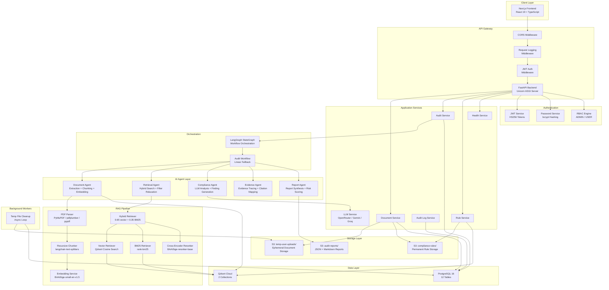

### 2.3 Component Interaction Diagram

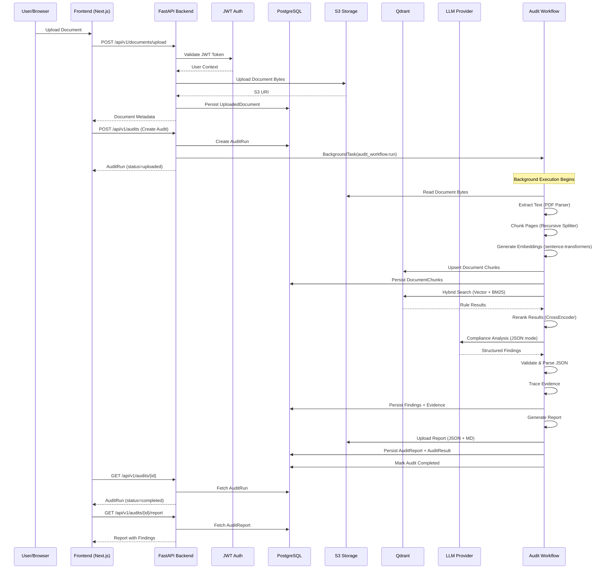

---

## 3. High-Level Design (HLD)

### 3.1 Enterprise Architecture Overview

```
┌──────────────────────────────────────────────────────────────────────────┐
│                         CLIENT TIER                                      │
│  ┌─────────────────────────────────────────────────────────────────┐     │
│  │  Next.js 15 Frontend (React 19 + TypeScript + TailwindCSS)     │     │
│  │  ├── Authentication (Login/Register)                            │     │
│  │  ├── Dashboard (Document List, Audit History)                   │     │
│  │  ├── Upload Flow (PDF/DOCX/TXT + Raw Text)                     │     │
│  │  ├── Audit Results & Evidence Viewer                            │     │
│  │  ├── Admin Panel (Users, Rules, Analytics, Storage)             │     │
│  │  └── Settings & Profile Management                              │     │
│  └─────────────────────────────────────────────────────────────────┘     │
└──────────────────────────────────────────────────────────────────────────┘
                                    │ HTTPS / REST
                                    ▼
┌──────────────────────────────────────────────────────────────────────────┐
│                         API TIER                                         │
│  ┌─────────────────────────────────────────────────────────────────┐     │
│  │  FastAPI Application (Uvicorn ASGI)                             │     │
│  │  ├── CORS Middleware                                            │     │
│  │  ├── Request Logging Middleware (latency tracking)              │     │
│  │  ├── JWT Authentication (OAuth2 Bearer)                         │     │
│  │  ├── RBAC Authorization (ADMIN / USER)                          │     │
│  │  │                                                              │     │
│  │  ├── /api/v1/auth     — Register, Login, Me                    │     │
│  │  ├── /api/v1/documents — Upload, List                          │     │
│  │  ├── /api/v1/audits   — Create, List, Get, Findings, Evidence  │     │
│  │  ├── /api/v1/audit    — Legacy Compat (run, report)            │     │
│  │  ├── /api/v1/reports  — Get Report by ID                       │     │
│  │  ├── /api/v1/rules    — Upload Compliance Rules                │     │
│  │  ├── /api/v1/admin    — Users, Documents, Analytics, Logs      │     │
│  │  └── /api/v1/health   — Dependency Health Checks               │     │
│  └─────────────────────────────────────────────────────────────────┘     │
└──────────────────────────────────────────────────────────────────────────┘
                                    │
                    ┌───────────────┼───────────────┐
                    ▼               ▼               ▼
┌──────────────────────┐ ┌──────────────────┐ ┌──────────────────────┐
│    SERVICE TIER      │ │  AGENT TIER      │ │  WORKER TIER         │
│  ┌────────────────┐  │ │ ┌──────────────┐ │ │ ┌──────────────────┐ │
│  │ AuditService   │  │ │ │ DocumentAgent│ │ │ │ AuditWorkflow    │ │
│  │ DocumentService│  │ │ │ RetrievalAgt │ │ │ │ (LangGraph)      │ │
│  │ RuleService    │  │ │ │ ComplianceAgt│ │ │ ├──────────────────┤ │
│  │ LLMService     │  │ │ │ EvidenceAgent│ │ │ │ CleanupWorker    │ │
│  │ HealthService  │  │ │ │ ReportAgent  │ │ │ │ (Async Loop)     │ │
│  │ AuditLogSvc    │  │ │ └──────────────┘ │ │ └──────────────────┘ │
│  └────────────────┘  │ └──────────────────┘ └──────────────────────┘
└──────────────────────┘
                    │               │               │
        ┌───────────┴───────┬───────┴────────┬──────┘
        ▼                   ▼                ▼
┌──────────────────┐ ┌──────────────────┐ ┌──────────────────┐
│   PostgreSQL 16  │ │   Qdrant Cloud   │ │   AWS S3         │
│  ┌────────────┐  │ │ ┌──────────────┐ │ │ ┌──────────────┐ │
│  │ users      │  │ │ │compliance_   │ │ │ │compliance-   │ │
│  │ uploaded_  │  │ │ │rules         │ │ │ │rules/        │ │
│  │ documents  │  │ │ │(Rule Vectors)│ │ │ │              │ │
│  │ document_  │  │ │ ├──────────────┤ │ │ ├──────────────┤ │
│  │ chunks     │  │ │ │audit_document│ │ │ │temp-user-    │ │
│  │ audit_runs │  │ │ │_chunks       │ │ │ │uploads/      │ │
│  │ findings   │  │ │ │(Doc Vectors) │ │ │ │              │ │
│  │ evidence_  │  │ │ └──────────────┘ │ │ ├──────────────┤ │
│  │ links      │  │ └──────────────────┘ │ │audit-reports/│ │
│  │ audit_     │  │                       │ └──────────────┘ │
│  │ reports    │  │                       └──────────────────┘
│  │ audit_     │  │
│  │ results    │  │
│  │ reports    │  │
│  │ documents  │  │
│  │ rule_      │  │
│  │ documents  │  │
│  │ compliance_│  │
│  │ rules      │  │
│  │ compliance_│  │
│  │ domains    │  │
│  │ audit_logs │  │
│  └────────────┘  │
└──────────────────┘
```

### 3.2 Service Communication Diagram

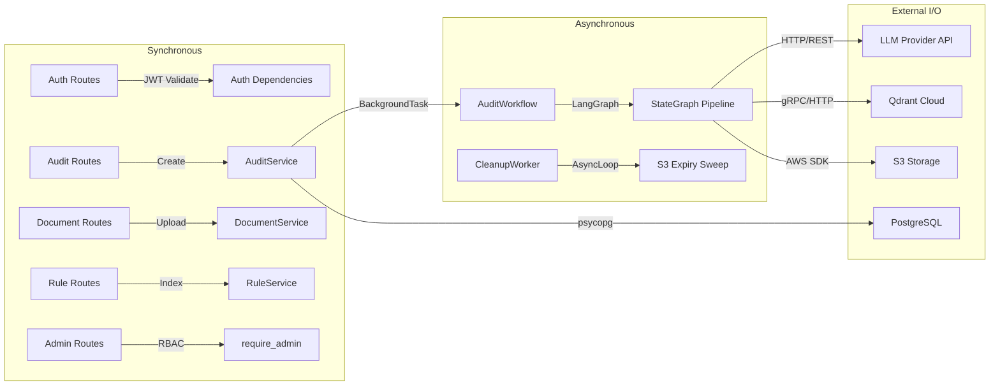

### 3.3 Infrastructure Diagram

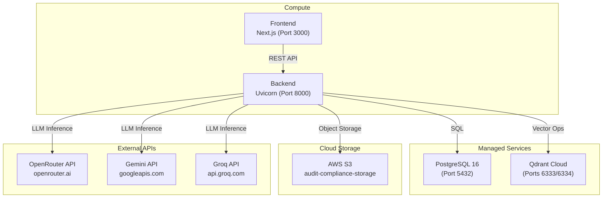

---

## 4. Low-Level Design (LLD)

### 4.1 Backend Module Architecture

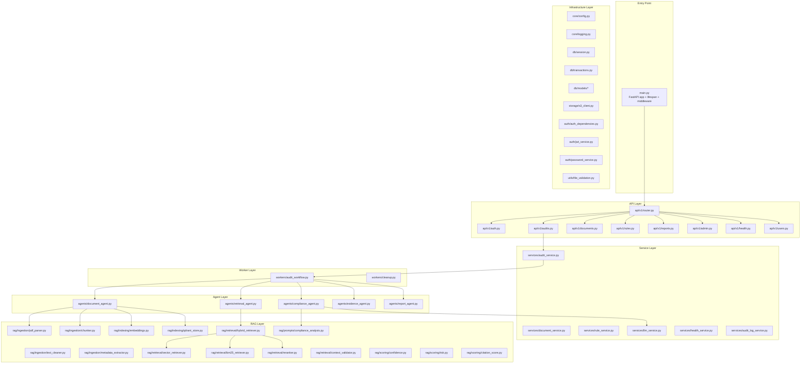

### 4.2 Class-Level Responsibilities

#### 4.2.1 Core Configuration (`core/config.py`)

The `Settings` class (extending Pydantic `BaseSettings`) centralizes all environment-driven configuration:

| Property Group | Key Settings | Description |
|---|---|---|
| **Application** | `app_name`, `app_env`, `debug`, `log_level` | Runtime environment identity |
| **API** | `api_v1_prefix`, `cors_origins` | API versioning and CORS configuration |
| **Database** | `database_url` | PostgreSQL connection string |
| **Authentication** | `jwt_secret_key`, `jwt_algorithm`, `jwt_access_token_minutes` | JWT token parameters |
| **AWS/S3** | `aws_access_key_id`, `aws_secret_access_key`, `s3_bucket` | Cloud storage credentials |
| **Qdrant** | `qdrant_url`, `qdrant_api_key`, `qdrant_rule_collection`, `qdrant_upload_collection` | Vector database connection |
| **LLM** | `llm_provider`, `openrouter_api_key`, `gemini_api_key`, `groq_api_key` | Multi-provider LLM configuration |
| **RAG** | `embedding_model`, `chunk_size`, `chunk_overlap`, `top_k_vector`, `top_k_bm25`, `final_top_k` | Retrieval pipeline tuning |
| **Reranking** | `enable_reranking`, `reranker_model` | Cross-encoder reranking toggle |
| **Storage** | `storage_root`, `temp_document_retention_hours`, `cleanup_interval_seconds` | Document lifecycle management |

**Configuration Resolution Chain:** `.env` file → Environment Variables → Pydantic defaults. All settings support `AliasChoices` for flexible environment variable naming.

#### 4.2.2 Database Session Management (`db/session.py`)

```python
# Engine creation with connection pooling
engine = create_engine(
    _normalize_database_url(settings.database_url),
    pool_pre_ping=True,  # Validates connections before use
    future=True,          # SQLAlchemy 2.0 style
)

# Session factory with explicit transaction control
SessionLocal = sessionmaker(
    autocommit=False,
    autoflush=False,
    bind=engine,
    expire_on_commit=False,  # Prevents lazy-load after commit
)
```

The `init_db()` function performs:
1. `Base.metadata.create_all()` — Creates all tables from ORM models
2. `_ensure_incremental_columns()` — Schema migration for evolving table definitions (ALTER TABLE ADD COLUMN for missing columns)

#### 4.2.3 Transaction Management (`db/transactions.py`)

The `commit_or_rollback(db)` helper ensures atomicity:
- Attempts `db.commit()`
- On any `Exception`, performs `db.rollback()` and re-raises
- Guarantees no partial writes reach the database

### 4.3 Request Lifecycle

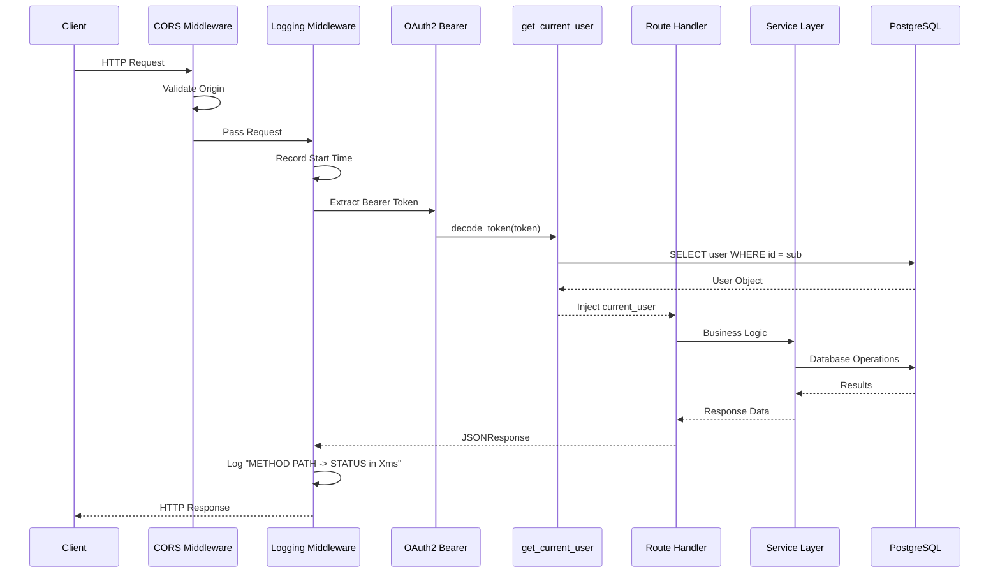

### 4.4 Middleware Execution Order

1. **CORS Middleware** — Validates `Origin` header against `cors_origin_list`, adds CORS response headers
2. **Request Logging Middleware** — Captures request start time, logs `METHOD PATH -> STATUS_CODE in LATENCY_MS` on completion, catches unhandled exceptions and returns 500 with sanitized error
3. **OAuth2 Bearer** — Extracts JWT from `Authorization: Bearer <token>` header
4. **Dependency Injection** — FastAPI `Depends()` chain resolves `get_db()` session and `get_current_user()` in parallel

### 4.5 Internal Dependency Flow

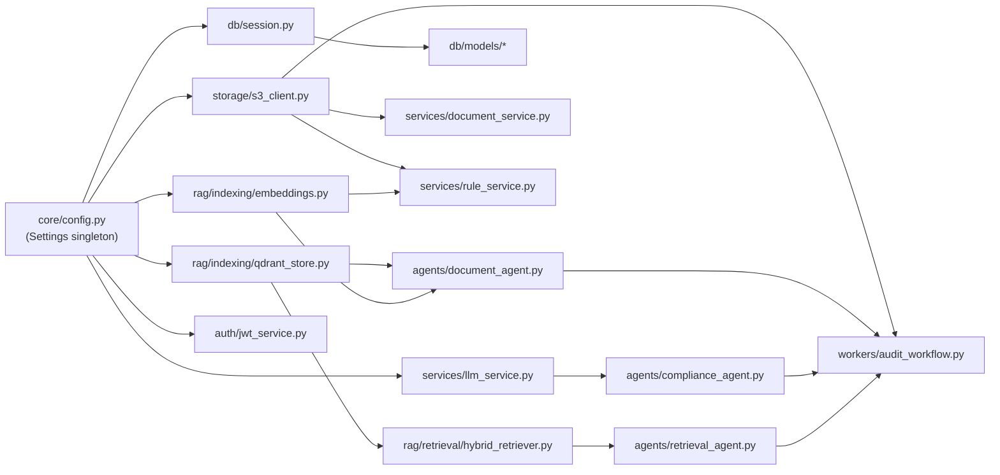

---

## 5. Complete Audit Workflow

### 5.1 End-to-End Flow Diagram

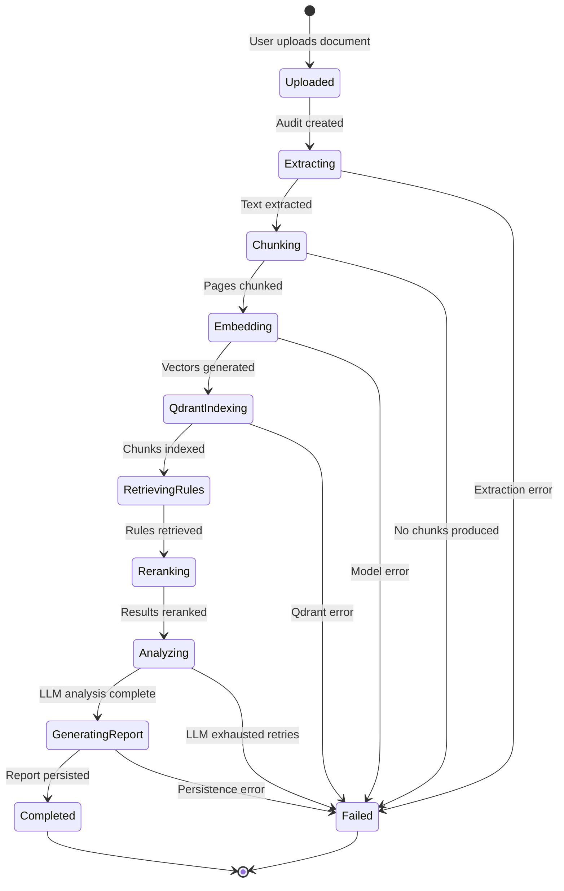

### 5.2 Step-by-Step Workflow Detail

#### Step 1: Document Upload

```
User → POST /api/v1/documents/upload
     → Form Data: title, domain, file (multipart) OR raw_text
```

**Processing:**
1. Validate file type against `allowed_file_types` (PDF, TXT, DOCX)
2. Validate file size against `max_upload_mb` (25 MB default)
3. Compute SHA-256 hash of file content for deduplication
4. Determine storage prefix based on user role:
   - `ADMIN` → `compliance-rules/` (permanent)
   - `USER` → `temp-user-uploads/` (ephemeral, 24-hour TTL)
5. Generate S3 key: `{prefix}/{user_id}/{document_id}/{filename}`

#### Step 2: S3 Storage

```python
s3_storage.upload_bytes(
    bucket=settings.upload_bucket,
    key=key,
    content=content,
    content_type=content_type,
    metadata={"uploaded-by": user_id, "role-type": role_type, "domain": domain},
    expires_at=datetime.utcnow() + timedelta(hours=24),  # USER only
)
```

The S3 client includes a **3-attempt retry** with `0.4 × (attempt + 1)` second backoff for transient failures.

#### Step 3: Metadata Persistence

Two database records are created in a single transaction:
- `UploadedDocument` — Primary document record with full metadata
- `DocumentRecord` — Mirror record in the legacy `documents` table for backward compatibility

Both records share the same UUID primary key.

#### Step 4: Text Extraction

The `DocumentAgent.process_upload()` method orchestrates extraction:

```python
content = s3_storage.read_uri_bytes(document.s3_uri)
pages = parse_document_bytes(content=content, filename=filename, content_type=content_type)
```

**Multi-parser fallback chain:**

| Priority | Parser | Library | Strengths |
|---|---|---|---|
| 1 | `_parse_pdf_with_pymupdf` | PyMuPDF (fitz) | Fastest, handles most PDFs |
| 2 | `_parse_pdf_with_pdfplumber` | pdfplumber | Better table extraction |
| 3 | `_parse_pdf_with_pypdf` | pypdf | Maximum compatibility |

For DOCX files: `python-docx` primary → XML ZIP fallback parser.  
For TXT files: Direct UTF-8 decode with error tolerance.

All extracted text passes through `clean_page_text()` which normalizes whitespace and removes control characters.

#### Step 5: Chunking

```python
chunks = chunk_pages(
    pages=pages,
    document_id=document.id,
    filename=filename,
    source_type="uploaded_document",
    extra_metadata={...},
)
```

**Chunking strategy:**
- **Algorithm**: `RecursiveCharacterTextSplitter` from `langchain-text-splitters`
- **Chunk size**: 800 characters (configurable via `CHUNK_SIZE`)
- **Overlap**: 120 characters (configurable via `CHUNK_OVERLAP`)
- **Separators** (priority order): `\n\n`, `\n`, `. `, `; `, `, `, ` `, ``

Each chunk receives a deterministic `chunk_id`:
```
{document_id}:p{page_number}:c{chunk_index}:{sha1_hash[:12]}
```

Metadata attached to each chunk:
- `document_id`, `filename`, `source_type`, `page_number`
- `section_title` (inferred from first line of page text)
- `citation_label` (e.g., `"policy_doc.pdf – Page 3 – Section: Data Protection"`)
- `domain`, `role_type`, `user_id`, `audit_id`

#### Step 6: Embedding Generation

```python
embeddings = embedding_service.embed_texts([chunk["text"] for chunk in chunks])
```

| Parameter | Value |
|---|---|
| Model | `BAAI/bge-small-en-v1.5` |
| Dimensions | 384 |
| Batch size | 32 |
| Normalization | `normalize_embeddings=True` |
| Loading | Lazy singleton with thread-safe locking |

The `EmbeddingService` uses a global lock (`GLOBAL_EMBEDDING_MODEL_LOCK`) to ensure the SentenceTransformer model is loaded exactly once across all threads.

#### Step 7: Qdrant Indexing

```python
vector_ids = qdrant_store.upsert_chunks(
    collection_name=settings.qdrant_upload_collection,  # "audit_document_chunks"
    chunks=chunks,
    embeddings=embeddings,
)
```

**Qdrant configuration:**
- **Collections**: `compliance_rules` (rules), `audit_document_chunks` (uploads)
- **Vector params**: 384 dimensions, Cosine distance
- **Point IDs**: UUID5 derived from chunk_id for deterministic deduplication
- **Payload indexes**: `source_type`, `document_id`, `chunk_id`, `domain`, `section`, `section_title`, `role_type`, `uploaded_by`, `user_id`, `audit_id`, `rule_set_id`
- **Retry**: 3 attempts with `0.4 × (attempt + 1)s` backoff

After Qdrant upsert, `DocumentChunk` records are persisted to PostgreSQL, creating a relational cross-reference to the vector store.

#### Step 8: Hybrid Retrieval

The `RetrievalAgent` builds a compliance query from the document text (filtering boilerplate header noise) and performs dual-path retrieval:

**Vector Path:**
```python
vector_results = vector_retriever.search(
    collection_name="compliance_rules",
    query=compliance_query,
    filters={"source_type": "compliance_rule", "domain": domain},
    top_k=25,  # settings.top_k_vector
)
```

**BM25 Path:**
```python
payloads = qdrant_store.scroll_payloads(collection_name="compliance_rules", filters=filters)
bm25_results = bm25_retriever.search(query=query, chunks=payloads, top_k=25)
```

**Filter Relaxation Strategy:**
1. First attempt: `source_type=compliance_rule` + `domain={domain}`
2. If empty: Relax domain filter, keep `source_type`
3. If still empty: Remove all filters except `rule_set_id` (if provided)

#### Step 9: Reranking

**Merge formula:**
- For chunks found by both vector and BM25: `score = 0.65 × vector_score + 0.35 × bm25_score`
- For BM25-only chunks: `score = 0.35 × bm25_score`
- Vector-only chunks keep their original score clamped to [0, 1]

**Domain prioritization:**
- Matching domain: `score += 0.08`
- Source type `compliance_rule`: `score += 0.02`

**Cross-Encoder Reranking** (when `ENABLE_RERANKING=true`):
```python
reranker = CrossEncoder("BAAI/bge-reranker-base")
pairs = [(query, result.text) for result in merged_results]
scores = reranker.predict(pairs)
# Sigmoid normalization for out-of-range scores
```

Final selection: Top-K results (default `final_top_k=8`) after reranking.

#### Step 10: Prompt Construction

The compliance prompt is built with **context budget management**:

```python
prompt = build_compliance_prompt(
    domain=domain,
    document_chunks=selected_chunks,
    rule_context=rule_context,
    max_context_chars=max_context_chars,  # 7000 default
)
```

Budget allocation: **58% for document chunks, 42% for rule context**.

Each chunk and rule is trimmed to stay within its per-item budget, preferring sentence boundaries for clean truncation.

The prompt instructs the LLM to return **strict JSON** with keys: `compliance_score`, `summary`, `findings[]`, `metadata`.

#### Step 11: LLM Analysis

The `ComplianceAgent` uses a **progressive degradation retry strategy**:

| Attempt | Rule Limit | Chunk Limit | Max Tokens | Context Chars | Text Char Limit |
|---|---|---|---|---|---|
| 1 | 5 | 5 | 900 | 7000 | 1500 |
| 2 | 3 | 4 | 1200 | 8000 | 1100 |
| 3 | 2 | 3 | 800 | 5000 | 800 |

Each retry reduces the context window to avoid token limit errors while maintaining analysis quality.

**LLM Provider Support:**

| Provider | Model | API Style |
|---|---|---|
| OpenRouter | `openai/gpt-4.1-mini` | OpenAI-compatible (SDK) |
| Gemini | `gemini-2.5-flash-lite` → fallback `gemini-2.0-flash` | Google REST API |
| Groq | `llama-3.3-70b-versatile` | OpenAI-compatible (SDK) |

All providers use `response_format: json_object` / `responseMimeType: application/json` for structured output.

#### Step 12: JSON Validation

The LLM response undergoes multi-stage validation:

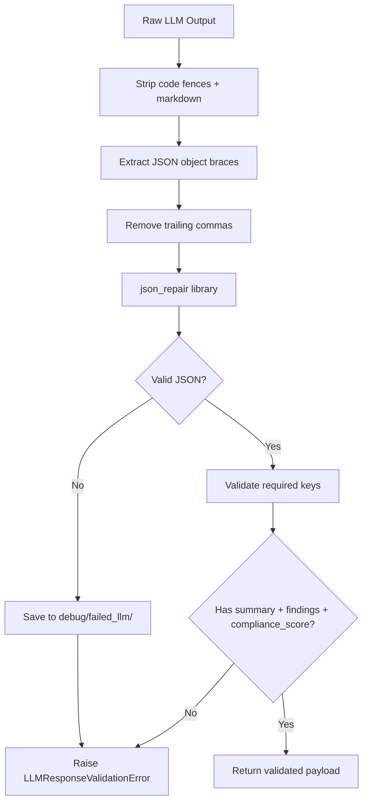

Failed LLM outputs are persisted to `storage/debug/failed_llm/` for post-mortem analysis.

#### Step 13: Findings Generation

Each raw finding from the LLM is enriched with:

1. **Rule matching** — Best-match rule result using citation + term overlap scoring
2. **Chunk matching** — Best-match document chunk using evidence term overlap
3. **Severity normalization** — Enforced to `LOW | MEDIUM | HIGH`
4. **Finding type normalization** — Enforced to `missing_clause | contradiction | weak_clause | risk`
5. **Confidence scoring** — `max(llm_confidence, heuristic_confidence)` where heuristic uses retrieval score, evidence score, and overlap score
6. **Text truncation** — All text fields capped at 2000 characters

#### Step 14: Evidence Tracing

The `EvidenceAgent.trace()` method creates two `EvidenceDraft` objects per finding:

1. **Rule Evidence** — Links to the matched compliance rule:
   - `source_type`: `compliance_rule`
   - `qdrant_point_id`: Qdrant vector ID of the rule chunk
   - `page_number`, `section_title` from rule metadata
   - `confidence_score` from `citation_quality_score()` heuristic

2. **Upload Evidence** — Links to the matched document excerpt:
   - `source_type`: `uploaded_document`
   - `qdrant_point_id`: From the matched chunk's Qdrant ID
   - `citation_text`: Exact excerpt from the uploaded document (max 2000 chars)

Each `EvidenceDraft` is persisted as an `EvidenceLink` row with foreign key to the parent `Finding`.

#### Step 15: Report Persistence

The `ReportAgent.generate()` creates a structured report payload:

```json
{
  "compliance_score": 0.75,
  "total_violations": 3,
  "summary": "Audit identified 3 potential compliance findings.",
  "risk_counts": {"LOW": 1, "MEDIUM": 1, "HIGH": 1},
  "finding_count": 3,
  "findings": [...],
  "passed_rules": 5,
  "failed_rules": 3,
  "recommendations": [...],
  "context_ready": true,
  "metadata": {...},
  "status": "generated"
}
```

#### Step 16: Report Storage (S3 + Database)

**S3 artifacts:**
- `audit-reports/{user_id}/{audit_id}/audit-report.json` — Full structured report
- `audit-reports/{user_id}/{audit_id}/audit-report.md` — Human-readable Markdown

**Database records (single atomic transaction):**
1. `AuditResult` — Overall risk, confidence, summary
2. `AuditReport` — Full JSON payload with S3 URI reference
3. `ReportRecord` — Legacy mirror in `reports` table
4. `COMMIT` — All-or-nothing transaction

#### Step 17: Audit Completion

Final status updates in a single committed transaction:
- `AuditRun.status = "completed"`, `completed_at = now()`
- `UploadedDocument.status = "completed"`, `processing_stage = "completed"`
- `AuditRun.confidence_score` = average of all finding confidence scores
- `AuditRun.overall_risk` = highest risk level across findings

An `AuditLog` entry is recorded for the completion event.

### 5.3 Async Processing Flow

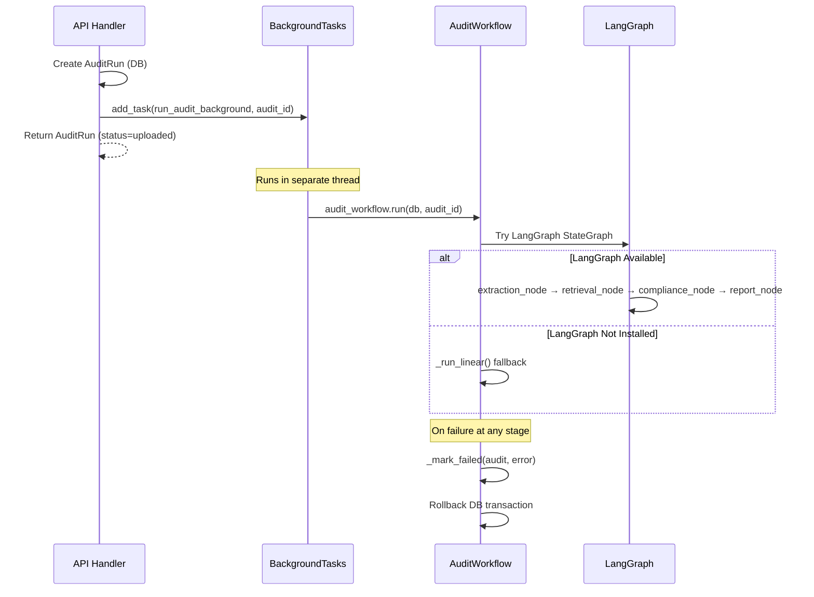

---

## 6. Agentic AI Architecture

### 6.1 Agent Overview

The system implements a **multi-agent architecture** where each agent has a single, well-defined responsibility:

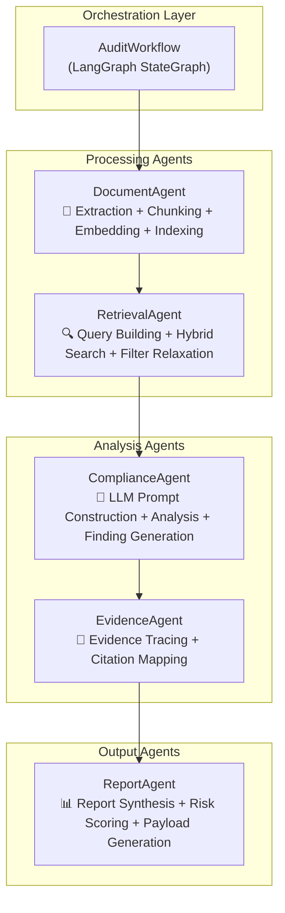

### 6.2 Agent Responsibilities

#### DocumentAgent (`agents/document_agent.py`)

| Method | Responsibility |
|---|---|
| `process_upload()` | Orchestrates the full ingestion pipeline |
| `_mark_stage()` | Updates document and audit status in DB at each stage |

**Pipeline stages managed:** `extracting` → `chunking` → `embedding` → `indexed`

Dependencies: `EmbeddingService`, `QdrantStore`, `s3_storage`, `pdf_parser`, `chunker`

#### RetrievalAgent (`agents/retrieval_agent.py`)

| Method | Responsibility |
|---|---|
| `retrieve_rules()` | Performs hybrid retrieval with progressive filter relaxation |
| `_build_compliance_query()` | Filters boilerplate header noise from query text |

**Query construction:** Selects 350 most content-bearing words, skipping header noise tokens (`version`, `confidential`, `copyright`, `table`, `contents`, etc.), short words (≤2 chars), and purely numeric tokens.

#### ComplianceAgent (`agents/compliance_agent.py`)

| Method | Responsibility |
|---|---|
| `evaluate_analysis()` | Full LLM analysis pipeline with retry degradation |
| `_build_rule_context()` | Enriches rules with diagnostic metadata (coverage, missing terms, contradiction signals) |
| `_select_document_chunks()` | Ranks chunks by rule-term overlap for optimal context selection |
| `_select_rule_results()` | Deduplicates and prioritizes rules by domain + source type |
| `_build_prompt_with_budget()` | Iterative prompt size reduction (72% per iteration) |
| `_findings_from_payload()` | Transforms raw LLM output into structured `FindingDraft` objects |
| `_rule_diagnostics()` | Computes coverage score, missing terms, contradiction signals per rule |

**Rule diagnostics computation:**
- `coverage_score` = `|rule_terms ∩ document_terms| / |rule_terms|`
- `missing_terms` = `rule_terms - document_terms` (top 20)
- `contradiction_signals` = Detected when rule contains obligation terms (`must`, `shall`, `required`) and document contains negation terms (`not`, `never`, `optional`)

#### EvidenceAgent (`agents/evidence_agent.py`)

| Method | Responsibility |
|---|---|
| `trace()` | Creates dual evidence chain (rule + document) for each finding |

Outputs two `EvidenceDraft` objects per finding, linking to both the matched rule and the matched uploaded document excerpt via Qdrant point IDs, page numbers, and section titles.

#### ReportAgent (`agents/report_agent.py`)

| Method | Responsibility |
|---|---|
| `generate()` | Synthesizes final audit report from findings and analysis |
| `_report_payload()` | Constructs the complete JSON report structure |

**Risk scoring:**
- `compliance_score` = From LLM analysis, or heuristic: `1.0 - (failed_rules / total_rules)`
- `overall_risk` = Highest severity across all findings
- `risk_counts` = Distribution of LOW/MEDIUM/HIGH findings

### 6.3 LangGraph Workflow

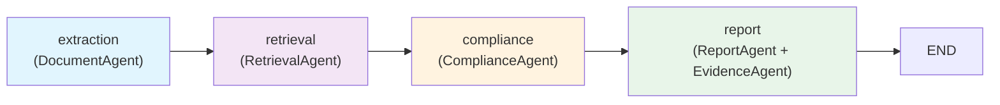

**State management:**

```python
class AuditWorkflowState(TypedDict):
    document: dict[str, Any]         # Document metadata
    processed: ProcessedDocument     # Extraction output
    retrieval: RetrievalOutput       # Retrieval results
    retrieved_rules: list[Any]       # Raw rule results
    analysis: ComplianceAnalysis     # LLM analysis output
    findings: list[FindingDraft]     # Generated findings
    persisted_findings: list[Finding] # DB-persisted findings
    report: dict[str, Any]           # Final report payload
    status: str                      # Current workflow stage
```

Each node function returns a **new state dict** that is merged with the existing state, ensuring immutable state transitions.

**Fallback behavior:** If LangGraph is not installed (`ImportError`), the workflow silently falls back to a linear execution path (`_run_linear()`) that calls the same agent methods sequentially.

### 6.4 Agent Communication Pattern

Agents communicate through **data passing** (not message passing):

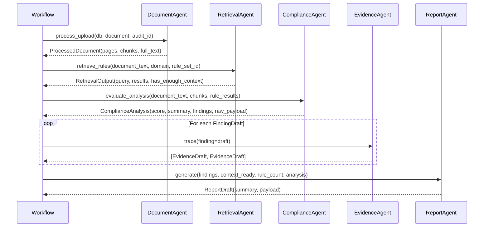

### 6.5 Failure Handling

| Agent | Failure Mode | Recovery Strategy |
|---|---|---|
| DocumentAgent | S3 read failure | Raise → Workflow marks audit `failed` |
| DocumentAgent | Extraction produces no text | `ValueError` → Audit fails |
| DocumentAgent | Qdrant upsert mismatch | `RuntimeError` → Audit fails |
| RetrievalAgent | Vector search fails | Warning logged, empty results |
| RetrievalAgent | BM25 search fails | Warning logged, vector-only results |
| RetrievalAgent | No results at all | Progressive filter relaxation (3 attempts) |
| ComplianceAgent | LLM returns invalid JSON | `json_repair` → retry with smaller context |
| ComplianceAgent | LLM timeout/rate limit | Retry with reduced token budget |
| ComplianceAgent | All LLM retries exhausted | `ComplianceAnalysisFailed` → Audit fails |
| ComplianceAgent | Zero findings + LLM error | `_assert_analysis_finalizable()` blocks masked-compliant report |
| EvidenceAgent | Missing metadata | Graceful degradation with `None` fields |
| ReportAgent | Missing analysis | Heuristic summary generation |

### 6.6 Token Optimization

The system employs several strategies to minimize token consumption:

1. **Progressive context reduction**: Each retry attempt reduces `max_context_chars` and `max_tokens`
2. **Budget-aware prompt construction**: 4 iteration loop reducing budget by 28% per iteration
3. **Context deduplication**: `_normalized_context_key()` prevents duplicate rules/chunks
4. **Important term extraction**: Stop-word filtering reduces noise in compliance queries
5. **Smart truncation**: Prefers sentence boundaries over arbitrary character cuts
6. **Token estimation**: `estimate_tokens()` provides pre-flight cost projection

---

## 7. RAG Architecture

### 7.1 RAG Pipeline Overview

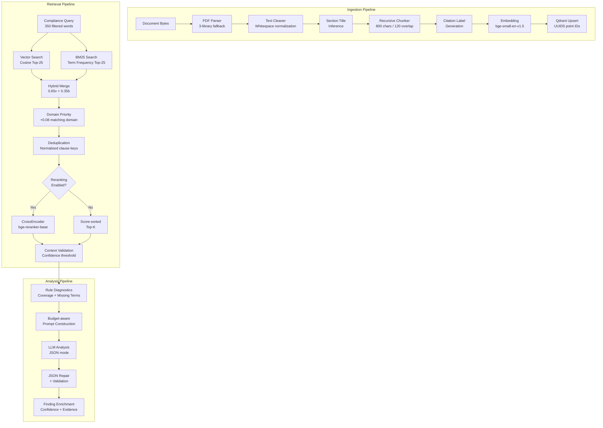

### 7.2 Chunking Strategy

**Algorithm:** `RecursiveCharacterTextSplitter` from langchain-text-splitters

**Configuration:**
- `chunk_size`: 800 characters (configurable)
- `chunk_overlap`: 120 characters (configurable)
- `separators`: `["\n\n", "\n", ". ", "; ", ", ", " ", ""]`

**Rationale:** 800-character chunks balance semantic completeness with embedding model context windows. The 120-character overlap ensures cross-chunk continuity for sentences spanning chunk boundaries. The recursive separator chain preserves paragraph → sentence → phrase → word → character boundaries in descending priority.

**Fallback:** If `langchain-text-splitters` is unavailable, a simple word-based sliding window chunker is used.

### 7.3 Embedding Pipeline

```python
class EmbeddingService:
    model_name = "BAAI/bge-small-en-v1.5"  # 384 dimensions
    
    def embed_texts(self, texts: list[str]) -> list[list[float]]:
        vectors = self.model.encode(
            texts,
            batch_size=32,
            normalize_embeddings=True,  # L2 normalization for cosine similarity
            show_progress_bar=False,
        )
        return [vector.tolist() for vector in vectors]
```

**Model characteristics:**
- **Dimensions**: 384
- **Max sequence length**: 512 tokens
- **Normalization**: L2-normalized (dot product ≡ cosine similarity)
- **Loading**: Thread-safe singleton with global lock

### 7.4 Qdrant Indexing

**Collection configuration:**
```python
VectorParams(size=384, distance=Distance.COSINE)
```

**Payload indexes (keyword type):**
`source_type`, `document_id`, `chunk_id`, `domain`, `source`, `section`, `section_title`, `role_type`, `uploaded_by`, `user_id`, `audit_id`, `rule_set_id`

**Upsert strategy:**
- Point IDs: `UUID5(NAMESPACE_URL, chunk_id)` — deterministic, enables idempotent re-indexing
- Named vector support: Automatically detects and uses named vectors (e.g., `"dense"`) if the collection was created with named vector config

### 7.5 Hybrid Retrieval

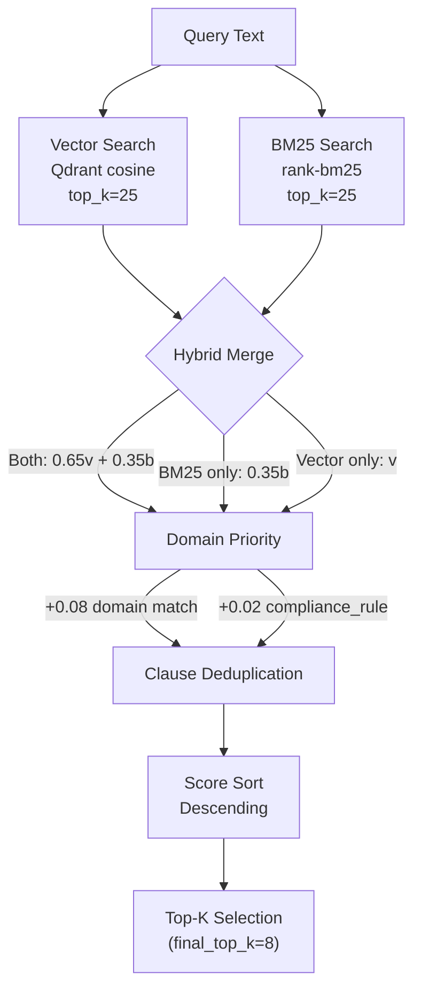

**BM25 implementation:** Uses `rank-bm25` library with custom tokenization (lowercase, alphanumeric filtering, minimum 2-character tokens).

### 7.6 Reranking

When enabled (`ENABLE_RERANKING=true`), the `CrossEncoder` model (`BAAI/bge-reranker-base`) scores each (query, result) pair:

```python
pairs = [(query, result.text) for result in merged_results]
scores = model.predict(pairs)
# Sigmoid normalization for scores outside [0, 1]
normalized = [1 / (1 + exp(-score)) for score in scores]
```

**Fallback behavior:** If the reranker model fails to load or predict, the system falls back to hybrid score-sorted results with a warning log.

### 7.7 Context Validation

The `ContextValidator` checks if retrieved results meet the confidence threshold:

```python
def has_enough_context(results: list[RetrievalResult]) -> bool:
    if not results:
        return False
    return any(result.score >= settings.min_confidence_threshold for result in results)
    # min_confidence_threshold = 0.65 default
```

Results below `semantic_similarity_threshold` (0.2) are filtered out during validation.

---

## 8. Database Architecture

### 8.1 Entity-Relationship Diagram

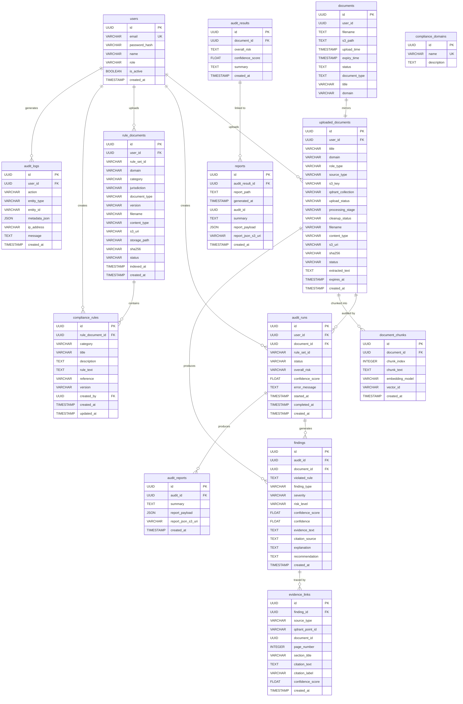

### 8.2 Table Relationships

| Parent Table | Child Table | Relationship | FK Column |
|---|---|---|---|
| `users` | `uploaded_documents` | 1:N | `user_id` |
| `users` | `audit_runs` | 1:N | `user_id` |
| `users` | `rule_documents` | 1:N | `user_id` |
| `users` | `compliance_rules` | 1:N | `created_by` |
| `users` | `audit_logs` | 1:N | `user_id` |
| `uploaded_documents` | `audit_runs` | 1:N | `document_id` |
| `uploaded_documents` | `document_chunks` | 1:N | `document_id` |
| `uploaded_documents` | `findings` | 1:N | `document_id` |
| `audit_runs` | `findings` | 1:N | `audit_id` |
| `audit_runs` | `audit_reports` | 1:1 | `audit_id` |
| `findings` | `evidence_links` | 1:N | `finding_id` |
| `rule_documents` | `compliance_rules` | 1:N | `rule_document_id` |
| `documents` | `audit_results` | 1:N | `document_id` |
| `audit_results` | `reports` | 1:N | `audit_result_id` |

### 8.3 Indexing Strategy

| Table | Indexed Columns | Type |
|---|---|---|
| `users` | `email` (unique), `role` | B-tree |
| `uploaded_documents` | `user_id`, `domain`, `role_type`, `upload_status`, `processing_stage`, `cleanup_status`, `status`, `expires_at` | B-tree |
| `document_chunks` | `document_id` | B-tree |
| `audit_runs` | `user_id`, `document_id`, `status` | B-tree |
| `findings` | `audit_id`, `document_id` | B-tree |
| `evidence_links` | `finding_id` | B-tree |
| `audit_reports` | `audit_id` | B-tree |
| `audit_results` | `document_id` | B-tree |
| `rule_documents` | `user_id`, `rule_set_id`, `category`, `status` | B-tree |
| `compliance_rules` | `rule_document_id`, `category`, `created_by` | B-tree |
| `audit_logs` | `user_id`, `action`, `entity_type`, `entity_id`, `created_at` | B-tree |

### 8.4 Deletion Strategy

Document deletion (admin) uses **cascading manual deletion** to respect referential integrity:

```
1. DELETE evidence_links WHERE finding_id IN (findings for document)
2. DELETE findings WHERE audit_id IN (audits for document) OR document_id = X
3. DELETE audit_reports WHERE audit_id IN (audits for document)
4. UPDATE reports SET audit_result_id = NULL (break FK)
5. DELETE audit_results WHERE document_id = X
6. DELETE reports WHERE audit_id IN (audits for document)
7. DELETE audit_runs WHERE document_id = X
8. DELETE document_chunks WHERE document_id = X
9. DELETE documents WHERE id = X (mirror table)
10. DELETE Qdrant points WHERE document_id = X
11. DELETE S3 objects (document + report artifacts)
12. DELETE uploaded_documents WHERE id = X
13. COMMIT
```

### 8.5 Transaction Consistency

All multi-table writes use the `commit_or_rollback(db)` pattern:

```python
def commit_or_rollback(db: Session) -> None:
    try:
        db.commit()
    except Exception:
        db.rollback()
        raise
```

Critical transaction boundaries:
- Document upload: `UploadedDocument` + `DocumentRecord` in single commit
- Finding persistence: All findings + evidence links flushed, then `AuditResult` + `AuditReport` + `ReportRecord` committed atomically
- Audit completion: Status updates on both `AuditRun` and `UploadedDocument` in single commit

---

## 9. Admin Module Architecture

### 9.1 RBAC Model

```mermaid
graph TD
    subgraph "Roles"
        ADMIN["ADMIN Role"]
        USER["USER Role"]
    end

    subgraph "Permissions"
        P1["View own documents"]
        P2["Upload documents"]
        P3["Create audits"]
        P4["View own audit results"]
        P5["View all users"]
        P6["View all documents"]
        P7["Delete any document"]
        P8["Upload compliance rules"]
        P9["Create compliance rules"]
        P10["View analytics"]
        P11["View system logs"]
        P12["Monitor storage"]
        P13["Monitor Qdrant"]
        P14["Manage rule categories"]
        P15["View all audits"]
    end

    ADMIN --> P1 & P2 & P3 & P4 & P5 & P6 & P7 & P8 & P9 & P10 & P11 & P12 & P13 & P14 & P15
    USER --> P1 & P2 & P3 & P4
```

**Role Assignment:**
- First registered user → Automatically `ADMIN`
- Email in `DEFAULT_ADMIN_EMAILS` → Automatically `ADMIN`
- All other registrations → `USER` (or requested role if valid)

### 9.2 Admin API Endpoints

| Method | Endpoint | Description |
|---|---|---|
| `GET` | `/admin/users` | List all users with metadata |
| `GET` | `/admin/documents` | List all uploaded + rule documents |
| `POST` | `/admin/documents/upload` | Upload admin document (permanent) |
| `POST` | `/admin/rules/upload` | Upload and index compliance rule document |
| `DELETE` | `/admin/document/{id}` | Delete document + cascading artifacts |
| `GET` | `/admin/audit-reports` | List all audit reports |
| `GET` | `/admin/compliance-rules` | List all compliance rules |
| `POST` | `/admin/compliance-rules` | Create manual compliance rule + index in Qdrant |
| `GET` | `/admin/rule-categories` | List compliance domains |
| `POST` | `/admin/rule-categories` | Create compliance domain |
| `GET` | `/admin/analytics` | Platform analytics dashboard data |
| `GET` | `/admin/logs` | Recent 200 audit log entries |
| `GET` | `/admin/storage` | S3 storage monitoring |
| `GET` | `/admin/qdrant` | Qdrant collection monitoring |

### 9.3 Auth Middleware Flow

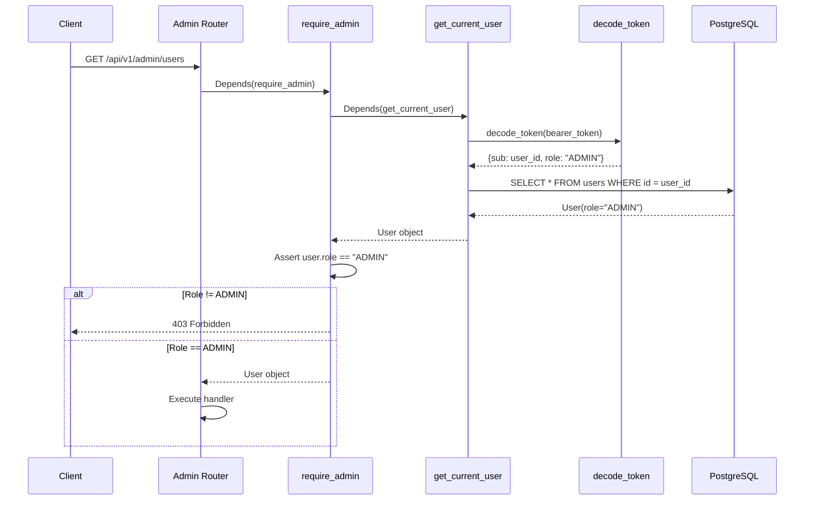

---

## 10. API Architecture

### 10.1 Complete API Surface

#### Authentication (`/api/v1/auth`)

| Method | Endpoint | Auth | Request | Response |
|---|---|---|---|---|
| `POST` | `/auth/register` | None | `{email, password, full_name?, role?}` | `UserResponse` (201) |
| `POST` | `/auth/login` | None | `{email, password}` | `{access_token, refresh_token, token_type}` |
| `GET` | `/auth/me` | Bearer | — | `UserResponse` |

#### Documents (`/api/v1/documents`)

| Method | Endpoint | Auth | Request | Response |
|---|---|---|---|---|
| `POST` | `/documents/upload` | Bearer | Multipart: `title`, `domain`, `file` OR `raw_text` | `DocumentResponse` |
| `GET` | `/documents` | Bearer | — | `[DocumentResponse]` |

#### Audits (`/api/v1/audits`)

| Method | Endpoint | Auth | Request | Response |
|---|---|---|---|---|
| `POST` | `/audits` | Bearer | `{document_id, rule_set_id?}` | `AuditResponse` |
| `GET` | `/audits` | Bearer | — | `[AuditResponse]` |
| `GET` | `/audits/{audit_id}` | Bearer | — | `AuditResponse` |
| `GET` | `/audits/{audit_id}/findings` | Bearer | — | `[FindingResponse]` |
| `GET` | `/audits/{audit_id}/evidence` | Bearer | — | `[EvidenceResponse]` |
| `GET` | `/audits/{audit_id}/report` | Bearer | — | `ReportResponse` |

#### Legacy Compat (`/api/v1/audit`)

| Method | Endpoint | Auth | Request | Response |
|---|---|---|---|---|
| `POST` | `/audit/run` | Bearer | `{document_id, rule_set_id?}` | `AuditResponse` |
| `GET` | `/audit/report/{id}` | Bearer | — | `ReportResponse` |

#### Health (`/api/v1/health`)

| Method | Endpoint | Auth | Response |
|---|---|---|---|
| `GET` | `/health` | None | Overall health status |
| `GET` | `/health/details` | None | Per-dependency health details |

### 10.2 Request/Response Examples

**Register:**
```json
// POST /api/v1/auth/register
// Request:
{
  "email": "auditor@company.com",
  "password": "SecurePass123!",
  "full_name": "Jane Auditor",
  "role": "USER"
}
// Response (201):
{
  "id": "550e8400-e29b-41d4-a716-446655440000",
  "email": "auditor@company.com",
  "full_name": "Jane Auditor",
  "role": "USER",
  "is_active": true
}
```

**Create Audit:**
```json
// POST /api/v1/audits
// Headers: Authorization: Bearer <jwt_token>
// Request:
{
  "document_id": "d47f3e24-1234-4567-890a-bcdef1234567",
  "rule_set_id": "default"
}
// Response (200):
{
  "id": "a1b2c3d4-5678-90ab-cdef-1234567890ab",
  "document_id": "d47f3e24-1234-4567-890a-bcdef1234567",
  "rule_set_id": "default",
  "status": "uploaded",
  "overall_risk": null,
  "confidence_score": null,
  "error_message": null,
  "started_at": null,
  "completed_at": null,
  "created_at": "2026-05-29T00:00:00"
}
```

### 10.3 API Request Lifecycle

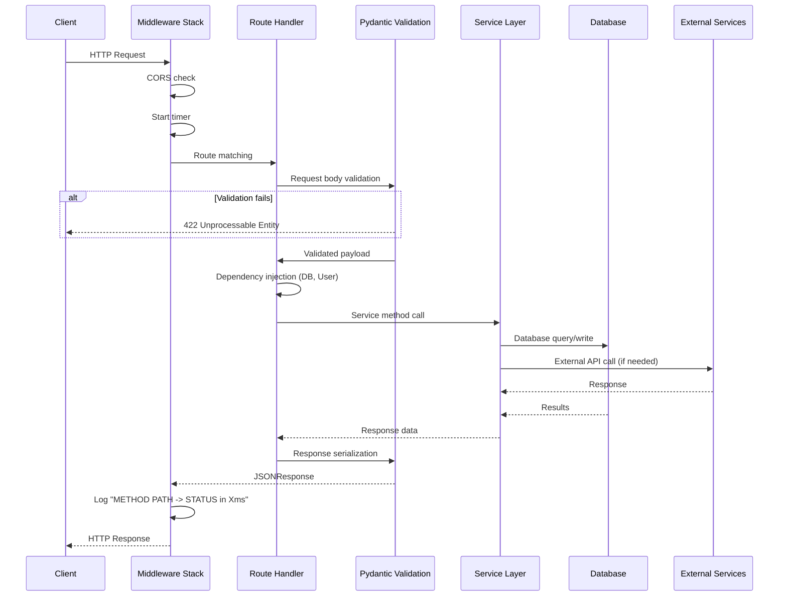

---

## 11. Infrastructure Architecture

### 11.1 Production Deployment Architecture

```
┌─────────────────────────────────────────────────────────────────────┐
│                        CDN / Edge Layer                              │
│  ┌───────────────────────────────────────────────────────────────┐  │
│  │  CloudFront / Vercel Edge Network                             │  │
│  │  SSL Termination + Static Asset Caching                       │  │
│  └───────────────────────────────────────────────────────────────┘  │
└─────────────────────────────────────────────────────────────────────┘
                              │
              ┌───────────────┴───────────────┐
              ▼                               ▼
┌──────────────────────┐         ┌──────────────────────┐
│  Frontend Hosting    │         │  Reverse Proxy       │
│  ┌────────────────┐  │         │  ┌────────────────┐  │
│  │ Next.js SSR    │  │         │  │ Nginx / ALB    │  │
│  │ Port 3000      │  │         │  │ SSL + Rate     │  │
│  │ Vercel / Docker│  │         │  │ Limiting       │  │
│  └────────────────┘  │         │  └────────────────┘  │
└──────────────────────┘         └──────────────────────┘
                                          │
                              ┌───────────┴───────────┐
                              ▼                       ▼
                   ┌──────────────────┐   ┌──────────────────┐
                   │ Backend Instance │   │ Backend Instance  │
                   │ Uvicorn :8000    │   │ Uvicorn :8000     │
                   │ Workers: 2-4     │   │ Workers: 2-4      │
                   └──────────────────┘   └──────────────────┘
                              │                       │
              ┌───────────────┼───────────────────────┘
              ▼               ▼               ▼
┌──────────────────┐ ┌──────────────────┐ ┌──────────────────┐
│  PostgreSQL 16   │ │  Qdrant Cloud    │ │  AWS S3          │
│  Primary + Read  │ │  Managed Cluster │ │  3 Buckets       │
│  Replica         │ │  Auto-scaling    │ │  Lifecycle Rules  │
└──────────────────┘ └──────────────────┘ └──────────────────┘
```

### 11.2 Docker Architecture

```yaml
# docker-compose.dev.yml
services:
  postgres:
    image: postgres:16
    container_name: audit_compliance_postgres
    environment:
      POSTGRES_DB: ${POSTGRES_DB:?Set POSTGRES_DB in .env}
      POSTGRES_USER: ${POSTGRES_USER:?Set POSTGRES_USER in .env}
      POSTGRES_PASSWORD: ${POSTGRES_PASSWORD:?Set POSTGRES_PASSWORD in .env}
    ports: ["5432:5432"]
    volumes: [postgres_data:/var/lib/postgresql/data]

  qdrant:
    image: qdrant/qdrant:latest
    container_name: audit_compliance_qdrant
    ports: ["6333:6333", "6334:6334"]
    volumes: [qdrant_data:/qdrant/storage]
```

### 11.3 CI/CD Pipeline

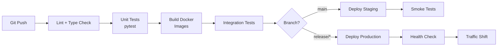

---

## 12. Security Architecture

### 12.1 Authentication Flow

```mermaid
sequenceDiagram
    participant User
    participant Frontend
    participant Backend
    participant JWT as JWT Service
    participant DB as PostgreSQL

    User->>Frontend: Enter credentials
    Frontend->>Backend: POST /auth/login {email, password}
    Backend->>DB: SELECT user WHERE email = ?
    DB-->>Backend: User record
    Backend->>Backend: verify_password(input, hash)
    alt Invalid credentials
        Backend-->>Frontend: 401 Unauthorized
    end
    Backend->>Backend: Check user.is_active
    alt Inactive account
        Backend-->>Frontend: 403 Forbidden
    end
    Backend->>JWT: create_access_token(sub=user.id, role=user.role)
    Backend->>JWT: create_refresh_token(sub=user.id, role=user.role)
    JWT-->>Backend: {access_token, refresh_token}
    Backend-->>Frontend: TokenResponse
    Frontend->>Frontend: Store tokens (httpOnly cookie / localStorage)
    
    Note over Frontend,Backend: Subsequent API calls
    Frontend->>Backend: GET /api/v1/audits<br/>Authorization: Bearer <access_token>
    Backend->>JWT: decode_token(token, expected_type="access")
    JWT-->>Backend: {sub: user_id, role: "USER"}
    Backend->>DB: SELECT user WHERE id = user_id
    DB-->>Backend: User
    Backend-->>Frontend: Protected resource
```

### 12.2 JWT Configuration

| Parameter | Value |
|---|---|
| Algorithm | HS256 |
| Access token expiry | 60 minutes |
| Refresh token expiry | 7 days |
| Secret key | `JWT_SECRET_KEY` environment variable |
| Token type claim | `type: "access"` or `type: "refresh"` |

### 12.3 Password Security

- **Algorithm**: bcrypt (via `passlib`)
- **Salt rounds**: Default (12)
- **Max password length**: 72 bytes (bcrypt limit)
- **Min password length**: 8 characters (Pydantic validation)

### 12.4 Security Controls

| Layer | Control | Implementation |
|---|---|---|
| **Transport** | HTTPS/TLS | SSL termination at reverse proxy |
| **Authentication** | JWT Bearer tokens | OAuth2 password bearer scheme |
| **Authorization** | RBAC (ADMIN/USER) | `require_admin` / `require_roles` dependencies |
| **Input Validation** | Pydantic schemas | Type-safe request validation |
| **File Validation** | Type + size checking | `validate_upload_file()` utility |
| **SQL Injection** | SQLAlchemy ORM | Parameterized queries only |
| **CORS** | Origin whitelist | `cors_origin_list` configuration |
| **Credential Isolation** | Environment variables | `.env` file, never in code |
| **Error Sanitization** | Debug mode toggle | Production hides internal errors |
| **Audit Trail** | `AuditLog` table | All mutations logged with user, action, entity |

### 12.5 Security Flow Diagram

```mermaid
flowchart TD
    A[Incoming Request] --> B{CORS Valid?}
    B -->|No| C[Block Request]
    B -->|Yes| D{Has Bearer Token?}
    D -->|No| E{Public Endpoint?}
    E -->|Yes| F[Allow]
    E -->|No| G[401 Unauthorized]
    D -->|Yes| H{Token Valid?}
    H -->|No| G
    H -->|Yes| I{Token Expired?}
    I -->|Yes| G
    I -->|No| J{User Active?}
    J -->|No| K[403 Forbidden]
    J -->|Yes| L{Role Authorized?}
    L -->|No| K
    L -->|Yes| M[Execute Handler]
    M --> N[Log to AuditLog]
```

---

## 13. Error Handling & Reliability

### 13.1 Retry Architecture

```mermaid
flowchart TD
    subgraph "LLM Retry (ComplianceAgent)"
        A1[Attempt 1<br/>5 rules, 5 chunks<br/>900 tokens, 7K context] -->|Fail| A2[Attempt 2<br/>3 rules, 4 chunks<br/>1200 tokens, 8K context]
        A2 -->|Fail| A3[Attempt 3<br/>2 rules, 3 chunks<br/>800 tokens, 5K context]
        A3 -->|Fail| A4[ComplianceAnalysisFailed]
        A1 -->|Success| OK1[Return Payload]
        A2 -->|Success| OK1
        A3 -->|Success| OK1
    end

    subgraph "Qdrant Retry (QdrantStore)"
        B1[Attempt 1] -->|Fail| B2[Sleep 0.4s<br/>Attempt 2]
        B2 -->|Fail| B3[Sleep 0.8s<br/>Attempt 3]
        B3 -->|Fail| B4[Raise Exception]
        B1 -->|Success| OK2[Return]
        B2 -->|Success| OK2
        B3 -->|Success| OK2
    end

    subgraph "S3 Retry (S3Storage)"
        C1[Attempt 1] -->|Fail| C2[Sleep 0.4s<br/>Attempt 2]
        C2 -->|Fail| C3[Sleep 0.8s<br/>Attempt 3]
        C3 -->|Fail| C4[Raise Exception]
    end

    subgraph "Gemini Retry (LLMService)"
        D1[Request 1] -->|503| D2[Sleep 5×attempt seconds<br/>Request 2]
        D2 -->|Fail| D3[Raise LLMHTTPError]
    end
```

### 13.2 Retryable Error Detection

```python
def is_retryable_llm_error(exc: Exception) -> bool:
    # Status code check
    if status_code in {402, 429, 500, 502, 503, 504}: return True
    # String marker check
    retryable_markers = (
        "402", "429", "500", "503",
        "insufficient credits", "rate limit",
        "timeout", "timed out",
        "temporarily unavailable", "server error",
    )
```

### 13.3 JSON Parse Recovery

```mermaid
flowchart TD
    A[Raw LLM Output] --> B[Strip code fences]
    B --> C[Find JSON braces]
    C --> D[Remove trailing commas]
    D --> E[json_repair library]
    E --> F{Repaired?}
    F -->|Different| G[Log repair + save debug file]
    F -->|Same| H[json.loads]
    G --> H
    H --> I{Valid dict?}
    I -->|No| J[Save failed output<br/>Raise error]
    I -->|Yes| K[Validate required keys]
    K --> L{All present?}
    L -->|No| M[Save + Raise LLMResponseValidationError]
    L -->|Yes| N[Return validated payload]
```

### 13.4 Graceful Degradation

| Component | Failure | Degradation |
|---|---|---|
| Reranker model | Load failure | Falls back to hybrid score sorting |
| Reranker model | Predict failure | Falls back to hybrid score sorting + disables for session |
| LangGraph | Not installed | Falls back to linear workflow |
| Vector search | Qdrant error | Warning logged, empty results (BM25 continues) |
| BM25 search | Error | Warning logged, vector-only results |
| S3 report upload | Error | Warning logged, report still persisted to DB |
| Embedding preload | Error | Warning logged, lazy-load on first use |
| Database connection | Startup failure | Warning logged, startup continues |

### 13.5 Transaction Rollback

Every database mutation is wrapped in `commit_or_rollback()`:

```python
def commit_or_rollback(db: Session) -> None:
    try:
        db.commit()
    except Exception:
        db.rollback()
        raise
```

The audit workflow has an additional top-level catch:
```python
try:
    self._run_langgraph(db, audit, document) or self._run_linear(db, audit, document)
except Exception as exc:
    db.rollback()
    self._mark_failed(db, audit_id, document_id, error=str(exc))
```

---

## 14. Logging & Monitoring

### 14.1 Structured Logging Architecture

The platform uses a structured logging system built on Python's standard `logging` module with a `log_pipeline_stage()` helper that produces machine-parseable log entries:

```python
log_pipeline_stage(
    logger,
    "STAGE_NAME",       # Pipeline stage identifier
    audit_id=audit_id,  # Correlation ID
    document_id=doc_id, # Document reference
    domain=domain,      # Compliance domain
    started_at=t0,      # Timing start
    status="completed", # Stage outcome
    **kwargs,           # Stage-specific metadata
)
```

### 14.2 Pipeline Stage Catalog

| Stage Tag | Component | Description |
|---|---|---|
| `UPLOAD` | DocumentService | Document upload to S3 |
| `DB_WRITE` | Multiple | Database persistence operations |
| `EXTRACTION` | DocumentAgent | PDF/DOCX/TXT text extraction |
| `CHUNKING` | DocumentAgent | Page chunking with RecursiveCharacterTextSplitter |
| `EMBEDDING` | DocumentAgent | sentence-transformers embedding generation |
| `QDRANT_UPSERT` | DocumentAgent | Vector indexing in Qdrant |
| `RETRIEVAL` | HybridRetriever | Combined vector + BM25 retrieval |
| `RERANKING` | Reranker | CrossEncoder reranking |
| `TOKEN_ESTIMATE` | LLMService | Pre-flight token count estimation |
| `LLM_REQUEST` | LLMService | LLM API call (start/complete/fail) |
| `LLM_RETRY` | ComplianceAgent | LLM retry scheduling |
| `LLM_MODEL_FALLBACK` | LLMService | Gemini model fallback selection |
| `LLM_JSON_PARSE_FAILED` | LLMService | JSON parse/validation failure |
| `LLM_JSON_REPAIR_SUCCESS` | LLMService | Successful JSON repair |
| `LLM_RAW_OUTPUT_SAVED` | LLMService | Debug output persistence |
| `JSON_PARSE` | LLMService | Successful JSON parse |
| `AGENT_ANALYSIS` | ComplianceAgent | Compliance analysis completion |
| `REPORT_GENERATION` | AuditWorkflow | Report generation outcome |
| `REPORT_PERSIST` | AuditWorkflow | Report database persistence |
| `S3_UPLOAD` | AuditWorkflow | Report S3 upload |
| `ADMIN_UPLOAD_START/SUCCESS/FAILED` | Admin API | Admin document operations |
| `ADMIN_DELETE_START/SUCCESS/FAILED` | Admin API | Admin deletion operations |
| `ADMIN_DELETE_DB` | Admin API | Cascading DB deletion |
| `ADMIN_DELETE_QDRANT` | Admin API | Qdrant point deletion |
| `ADMIN_DELETE_S3` | Admin API | S3 artifact deletion |

### 14.3 Log Examples

```
[UPLOAD] document_id=d47f... domain=legal status=completed bucket=audit-compliance-storage key=temp-user-uploads/... latency_ms=234
[EXTRACTION] audit_id=a1b2... document_id=d47f... status=completed page_count=12 text_chars=45230 latency_ms=1520
[CHUNKING] audit_id=a1b2... document_id=d47f... status=completed chunk_count=58 latency_ms=89
[EMBEDDING] audit_id=a1b2... document_id=d47f... status=completed chunk_count=58 embedding_model=BAAI/bge-small-en-v1.5 latency_ms=2340
[QDRANT_UPSERT] audit_id=a1b2... document_id=d47f... status=completed collection=audit_document_chunks point_count=58 latency_ms=456
[RETRIEVAL] audit_id=a1b2... collection=compliance_rules vector_count=25 bm25_count=18 merged_count=31 output_count=8 latency_ms=1890
[TOKEN_ESTIMATE] audit_id=a1b2... estimated_tokens=3420 prompt_chars=12560 max_tokens=900
[LLM_REQUEST] audit_id=a1b2... provider=gemini model=gemini-2.5-flash-lite attempt=1 status=completed latency_ms=8920
[AGENT_ANALYSIS] audit_id=a1b2... status=completed rule_count=3 chunk_count=5 finding_count=2 compliance_score=0.85 latency_ms=12450
[REPORT_GENERATION] audit_id=a1b2... status=completed finding_count=2 compliance_score=0.85 latency_ms=340
```

### 14.4 Monitoring Architecture Diagram

```mermaid
graph TD
    subgraph "Application Layer"
        App[FastAPI Application]
        MW[Request Logging Middleware<br/>Latency + Status]
        PL[Pipeline Stage Logger<br/>Stage + Timing + Metadata]
        AL[Audit Log Service<br/>User Action Tracking]
    end

    subgraph "Health Checks"
        HC[Health Service]
        HC --> DB_H[Database Health<br/>Schema validation]
        HC --> Q_H[Qdrant Health<br/>Collection + roundtrip]
        HC --> S3_H[S3 Health<br/>Bucket + roundtrip]
        HC --> LLM_H[LLM Health<br/>Provider + model ping]
        HC --> EMB_H[Embeddings Health<br/>Model + vector test]
        HC --> AUTH_H[Auth Health<br/>JWT + bcrypt test]
    end

    subgraph "Persistence"
        Logs[audit_logs table<br/>PostgreSQL]
        Debug[storage/debug/failed_llm/<br/>Failed LLM outputs]
        Stdout[stdout/stderr<br/>Structured logs]
    end

    App --> MW --> Stdout
    App --> PL --> Stdout
    App --> AL --> Logs
    PL -->|LLM failures| Debug
```

---

## 15. Scalability Design

### 15.1 Horizontal Scaling Strategy

```mermaid
graph TD
    subgraph "Load Balancer"
        LB["Nginx / ALB"]
    end

    subgraph "Stateless Backend Instances"
        B1["Backend 1<br/>Uvicorn"]
        B2["Backend 2<br/>Uvicorn"]
        B3["Backend N<br/>Uvicorn"]
    end

    subgraph "Shared State"
        PG["PostgreSQL<br/>(Primary + Read Replicas)"]
        QD["Qdrant Cloud<br/>(Auto-scaling)"]
        S3["AWS S3<br/>(Unlimited)"]
    end

    LB --> B1 & B2 & B3
    B1 & B2 & B3 --> PG & QD & S3
```

**Key design decisions enabling horizontal scaling:**
- Backend instances are **stateless** — all state is in PostgreSQL, Qdrant, and S3
- Embedding models are loaded per-process with global singleton pattern — no cross-process state
- Background audit workflows run in-process via `BackgroundTasks` — no shared queue required for MVP
- Session management uses `expire_on_commit=False` — prevents lazy-load issues across request boundaries

### 15.2 Async Workers

The current architecture uses FastAPI's `BackgroundTasks` for asynchronous audit execution:

```python
@router.post("", response_model=AuditResponse)
def create_audit(payload, background_tasks: BackgroundTasks, ...):
    audit = audit_service.create_audit(db=db, user=current_user, payload=payload)
    background_tasks.add_task(audit_service.run_audit_background, audit.id)
    return audit  # Returns immediately
```

The cleanup worker runs as an async loop within the application lifecycle:

```python
async def temp_file_cleanup_loop():
    while True:
        cleanup_expired_temp_files()
        await asyncio.sleep(settings.cleanup_interval_seconds)  # 3600s default
```

### 15.3 Vector Scaling

Qdrant Cloud provides automatic scaling for vector search:
- Collections auto-scale based on point count
- Payload indexes enable efficient filtering without full scans
- Named vector support allows future multi-vector configurations

### 15.4 Scalability Diagram

```mermaid
graph TB
    subgraph "Current Architecture"
        A[Single Process<br/>BackgroundTasks] --> B[In-memory<br/>Embedding Model]
        A --> C[Direct DB<br/>Connections]
    end

    subgraph "Scale-out Architecture"
        D[Celery Workers<br/>Redis/RabbitMQ Queue] --> E[Shared Model<br/>Cache/Service]
        D --> F[Connection Pool<br/>PgBouncer]
    end

    A -.->|Evolution| D
    B -.->|Evolution| E
    C -.->|Evolution| F
```

---

## 16. DevOps & Deployment

### 16.1 Environment Setup

**Backend:**
```bash
python -m pip install -e backend     # Install with dependencies
cp .env.example .env                  # Configure environment
python -m uvicorn backend.app.main:app --reload --host 127.0.0.1 --port 8000
```

**Frontend:**
```bash
cd frontend && npm install && npm run dev  # Development server on port 3000
```

**Infrastructure (Docker Compose):**
```bash
docker compose -f docker-compose.dev.yml up -d  # PostgreSQL + Qdrant
```

### 16.2 Environment Variables

| Variable | Required | Default | Description |
|---|---|---|---|
| `DATABASE_URL` | Yes | none | PostgreSQL or SQLite connection string from `.env` |
| `JWT_SECRET_KEY` | Yes | none | JWT signing secret from `.env` |
| `QDRANT_URL` | Yes | — | Qdrant Cloud endpoint |
| `QDRANT_API_KEY` | Yes | — | Qdrant API key |
| `LLM_PROVIDER` | Yes | `openrouter` | `openrouter` / `gemini` / `groq` |
| `OPENROUTER_API_KEY` | Conditional | — | OpenRouter API key |
| `GEMINI_API_KEY` | Conditional | — | Google Gemini API key |
| `AWS_ACCESS_KEY_ID` | Yes | — | S3 credentials |
| `AWS_SECRET_ACCESS_KEY` | Yes | — | S3 credentials |
| `S3_BUCKET` | Optional for analytics | none | Primary S3 bucket |

### 16.3 Deployment Pipeline

```mermaid
graph TD
    A[Developer Push] --> B[GitHub Actions]
    B --> C[Install Dependencies]
    C --> D[Run Linters<br/>ruff + mypy]
    D --> E[Run Tests<br/>pytest]
    E --> F[Build Docker Image]
    F --> G[Push to ECR/GCR]
    G --> H{Environment}
    H -->|staging| I[Deploy to Staging]
    H -->|production| J[Blue-Green Deploy]
    I --> K[Run Health Checks]
    J --> L[Run Health Checks]
    L --> M[Switch Traffic]

    style J fill:#e8f5e9
    style M fill:#c8e6c9
```

### 16.4 Rollback Strategy

1. **Instant rollback**: Revert to previous Docker image tag
2. **Database**: Alembic downgrade migration
3. **Qdrant**: Collections are forward-compatible; no vector migration needed
4. **S3**: Objects are immutable; no rollback needed

---

## 17. End-to-End Request Lifecycle

### 17.1 Complete Lifecycle Diagram

```mermaid
sequenceDiagram
    actor User
    participant UI as Next.js Frontend
    participant API as FastAPI Backend
    participant Auth as JWT Auth
    participant S3 as AWS S3
    participant DB as PostgreSQL
    participant Embed as Embedding Service
    participant QD as Qdrant Cloud
    participant LLM as LLM Provider

    Note over User,LLM: Phase 1: Document Upload
    User->>UI: Select PDF + Enter Title + Domain
    UI->>API: POST /api/v1/documents/upload (multipart)
    API->>Auth: Validate Bearer Token
    API->>API: validate_upload_file(type, size)
    API->>S3: upload_bytes(temp-user-uploads/...)
    S3-->>API: S3ObjectRef(uri)
    API->>DB: INSERT uploaded_documents + documents
    DB-->>API: Document record
    API-->>UI: DocumentResponse(id, status=uploaded)
    UI-->>User: "Document uploaded successfully"

    Note over User,LLM: Phase 2: Audit Initiation
    User->>UI: Click "Run Audit"
    UI->>API: POST /api/v1/audits {document_id}
    API->>DB: INSERT audit_runs (status=uploaded)
    API->>API: BackgroundTask → audit_workflow.run()
    API-->>UI: AuditResponse(status=uploaded)
    UI->>UI: Start polling GET /audits/{id}

    Note over API,LLM: Phase 3: Background Processing
    API->>S3: read_uri_bytes(document.s3_uri)
    S3-->>API: Document bytes
    API->>API: parse_document_bytes() [PyMuPDF→pdfplumber→pypdf]
    API->>DB: UPDATE status=extracting
    API->>API: chunk_pages() [RecursiveCharacterTextSplitter]
    API->>DB: UPDATE status=chunking
    API->>Embed: embed_texts(chunk_texts) [bge-small-en-v1.5]
    Embed-->>API: 384-dim vectors
    API->>DB: UPDATE status=embedding
    API->>QD: upsert_chunks(audit_document_chunks)
    QD-->>API: point_ids
    API->>DB: INSERT document_chunks

    Note over API,LLM: Phase 4: Hybrid Retrieval
    API->>DB: UPDATE status=retrieving_rules
    API->>QD: vector_search(compliance_rules, top_k=25)
    QD-->>API: Vector results
    API->>QD: scroll_payloads(compliance_rules)
    QD-->>API: All rule payloads
    API->>API: BM25 search(query, payloads, top_k=25)
    API->>API: Merge: 0.65×vector + 0.35×BM25
    API->>API: Domain priority + deduplication
    opt Reranking enabled
        API->>API: CrossEncoder.predict(query, results)
    end
    API->>API: Top-K selection (final_top_k=8)

    Note over API,LLM: Phase 5: LLM Analysis
    API->>DB: UPDATE status=analyzing
    API->>API: Build compliance prompt (budget-managed)
    API->>LLM: generate_json(system, user, max_tokens)
    LLM-->>API: Raw JSON response
    API->>API: clean_json → json_repair → validate
    API->>API: Generate FindingDrafts with evidence

    Note over API,LLM: Phase 6: Persistence & Completion
    API->>DB: UPDATE status=generating_report
    API->>DB: INSERT findings + evidence_links
    API->>API: ReportAgent.generate()
    API->>S3: Upload audit-report.json + audit-report.md
    API->>DB: INSERT audit_results + audit_reports + reports
    API->>DB: UPDATE audit_runs status=completed
    API->>DB: INSERT audit_logs (audit.completed)

    Note over User,LLM: Phase 7: Result Retrieval
    UI->>API: GET /api/v1/audits/{id} (polling)
    API-->>UI: AuditResponse(status=completed)
    UI->>API: GET /api/v1/audits/{id}/report
    API->>DB: SELECT audit_reports
    API-->>UI: ReportResponse(findings, score, summary)
    UI-->>User: Render audit report with evidence
```

---

## 18. Folder Structure Documentation

### 18.1 Complete Project Tree

```
Policy_Complice/
├── .env                              # Environment configuration
├── .env.example                      # Environment template
├── .gitignore                        # Git ignore rules
├── README.md                         # Project overview
├── alembic.ini                       # Alembic migration config
├── requirements.txt                  # Python dependencies
├── docker-compose.dev.yml            # Local infra (PostgreSQL + Qdrant)
│
├── backend/
│   ├── __init__.py
│   ├── pyproject.toml                # Python package config
│   ├── README.md
│   │
│   ├── alembic/                      # Database migrations
│   │   └── versions/
│   │
│   ├── tests/                        # Test suite
│   │
│   └── app/
│       ├── __init__.py
│       ├── main.py                   # FastAPI app entry point + lifespan + middleware
│       │
│       ├── core/
│       │   ├── config.py             # Pydantic Settings (260 lines, 50+ settings)
│       │   └── logging.py            # Structured logging helpers
│       │
│       ├── auth/
│       │   ├── auth_dependencies.py  # get_current_user, require_admin, require_roles
│       │   ├── jwt_service.py        # create_access_token, decode_token
│       │   └── password_service.py   # hash_password, verify_password (bcrypt)
│       │
│       ├── db/
│       │   ├── session.py            # Engine, SessionLocal, init_db, schema migration
│       │   ├── transactions.py       # commit_or_rollback helper
│       │   ├── models/
│       │   │   ├── __init__.py       # Model imports for auto-discovery
│       │   │   ├── user.py           # User model (users table)
│       │   │   ├── document.py       # UploadedDocument, DocumentRecord, DocumentChunk, ComplianceDomain
│       │   │   ├── audit.py          # AuditRun, Finding, EvidenceLink, AuditReport, AuditResult, ReportRecord
│       │   │   ├── rule.py           # RuleDocument, ComplianceRule
│       │   │   └── log.py            # AuditLog
│       │   └── repositories/         # (Reserved for repository pattern)
│       │
│       ├── schemas/
│       │   ├── auth.py               # RegisterRequest, LoginRequest, TokenResponse, UserResponse
│       │   ├── audit.py              # CreateAuditRequest, AuditResponse, FindingResponse, EvidenceResponse, ReportResponse
│       │   ├── document.py           # DocumentResponse
│       │   └── rule.py               # Rule-related schemas
│       │
│       ├── api/
│       │   └── v1/
│       │       ├── router.py         # API router aggregator (9 sub-routers)
│       │       ├── auth.py           # /auth/register, /auth/login, /auth/me
│       │       ├── audits.py         # /audits CRUD + /audit compat
│       │       ├── documents.py      # /documents/upload, /documents
│       │       ├── rules.py          # /rules/upload
│       │       ├── reports.py        # /reports/{id}
│       │       ├── admin.py          # /admin/* (925 lines, 15+ endpoints)
│       │       ├── health.py         # /health, /health/details
│       │       └── users.py          # /users/me
│       │
│       ├── services/
│       │   ├── audit_service.py      # Audit CRUD + workflow dispatch
│       │   ├── document_service.py   # Document upload + S3 + DB persistence
│       │   ├── rule_service.py       # Rule upload + extraction + embedding + Qdrant indexing
│       │   ├── llm_service.py        # Multi-provider LLM client (702 lines)
│       │   ├── health_service.py     # 6 dependency health checks (361 lines)
│       │   └── audit_log_service.py  # Audit trail logging
│       │
│       ├── agents/
│       │   ├── document_agent.py     # Extraction → Chunking → Embedding → Indexing
│       │   ├── retrieval_agent.py    # Query construction + hybrid retrieval
│       │   ├── compliance_agent.py   # LLM analysis + finding generation (665 lines)
│       │   ├── evidence_agent.py     # Evidence tracing + citation mapping
│       │   └── report_agent.py       # Report synthesis + risk scoring
│       │
│       ├── rag/
│       │   ├── ingestion/
│       │   │   ├── pdf_parser.py     # Multi-library PDF/DOCX/TXT parser
│       │   │   ├── chunker.py        # RecursiveCharacterTextSplitter wrapper
│       │   │   ├── text_cleaner.py   # Whitespace normalization
│       │   │   └── metadata_extractor.py  # Section title inference + citation labels
│       │   ├── indexing/
│       │   │   ├── embeddings.py     # SentenceTransformer embedding service
│       │   │   └── qdrant_store.py   # Qdrant client wrapper (264 lines)
│       │   ├── retrieval/
│       │   │   ├── vector_retriever.py    # Qdrant cosine search
│       │   │   ├── bm25_retriever.py      # BM25 term-frequency search
│       │   │   ├── hybrid_retriever.py    # Merge + domain priority + dedup
│       │   │   ├── reranker.py            # CrossEncoder reranking (177 lines)
│       │   │   ├── context_validator.py   # Confidence threshold validation
│       │   │   └── types.py               # RetrievalResult dataclass
│       │   ├── prompts/
│       │   │   └── compliance_analysis.py # System prompt + budget-aware prompt builder
│       │   └── scoring/
│       │       ├── confidence.py     # Heuristic confidence scoring
│       │       ├── risk.py           # Risk level computation
│       │       └── citation_score.py # Citation quality scoring
│       │
│       ├── workers/
│       │   ├── audit_workflow.py     # LangGraph + linear workflow (694 lines)
│       │   └── cleanup.py           # Expired temp file cleanup loop
│       │
│       ├── storage/
│       │   └── s3_client.py         # S3 CRUD with retry (152 lines)
│       │
│       └── utils/
│           └── file_validation.py   # Upload type + size validation
│
├── frontend/
│   ├── package.json                 # npm dependencies
│   ├── next.config.ts               # Next.js configuration
│   ├── tailwind.config.ts           # TailwindCSS configuration
│   ├── tsconfig.json                # TypeScript configuration
│   │
│   └── src/
│       ├── app/                     # Next.js App Router pages
│       │   ├── layout.tsx           # Root layout
│       │   ├── page.tsx             # Landing page
│       │   ├── globals.css          # Global styles
│       │   ├── providers.tsx        # Context providers
│       │   ├── login/               # Login page
│       │   ├── register/            # Registration page
│       │   ├── dashboard/           # Main dashboard
│       │   ├── audits/              # Audit pages
│       │   ├── admin/               # Admin panel
│       │   ├── rules/               # Rules management
│       │   └── settings/            # User settings
│       │
│       ├── components/              # Reusable UI components
│       │   ├── auth/                # Auth forms
│       │   ├── dashboard/           # Dashboard widgets
│       │   ├── evidence/            # Evidence viewer
│       │   ├── landing/             # Landing page sections
│       │   ├── layout/              # Layout components
│       │   ├── navigation/          # Nav bars
│       │   └── ui/                  # Base UI primitives
│       │
│       ├── features/                # Feature modules
│       │   ├── auth/                # Auth logic
│       │   ├── audits/              # Audit management
│       │   ├── evidence/            # Evidence display
│       │   ├── findings/            # Findings display
│       │   ├── reports/             # Report rendering
│       │   ├── rules/               # Rule management
│       │   └── uploads/             # Upload flow
│       │
│       ├── services/                # API client services
│       ├── lib/                     # Utility libraries
│       ├── providers/               # React context providers
│       └── types/                   # TypeScript type definitions
│
├── docs/                            # Architecture documentation
│   ├── README.md                    # Documentation index
│   ├── architecture.md              # System architecture
│   ├── database-schema.sql          # SQL DDL
│   ├── rag-pipeline.md              # RAG documentation
│   └── ... (19 documentation files)
│
└── storage/                         # Local storage (dev)
    ├── temp/                        # Ephemeral user uploads
    ├── rules/                       # Permanent rule documents
    ├── compliance/                  # Compliance documents
    └── policies/                    # Policy documents
```

---

## 19. Production Readiness Analysis

### 19.1 Strengths

| Area | Assessment | Detail |
|---|---|---|
| **Architecture** | ✅ Strong | Clean separation of concerns (agents, services, RAG, storage) |
| **Multi-provider LLM** | ✅ Strong | OpenRouter, Gemini, Groq with model fallback |
| **Hybrid RAG** | ✅ Strong | Vector + BM25 with optional reranking |
| **Evidence Tracing** | ✅ Strong | Dual-chain (rule + document) with Qdrant point references |
| **Error Recovery** | ✅ Strong | Progressive degradation, JSON repair, retry with context reduction |
| **Audit Trail** | ✅ Strong | Comprehensive AuditLog table + structured pipeline logging |
| **Health Checks** | ✅ Strong | 6 dependency checks with roundtrip validation |
| **Schema Evolution** | ✅ Good | `_ensure_incremental_columns()` handles missing columns |
| **File Parsing** | ✅ Good | 3-library PDF fallback + DOCX + TXT support |
| **Document Lifecycle** | ✅ Good | Auto-expiry with cleanup worker |
| **RBAC** | ✅ Good | Admin/User roles with auto-admin for first user |

### 19.2 Bottlenecks

| Area | Risk | Mitigation |
|---|---|---|
| **Synchronous embedding** | Medium | Embedding runs in-process; blocks worker thread during large documents |
| **In-process background tasks** | Medium | `BackgroundTasks` runs in the same process; audit workflow blocks one thread |
| **BM25 full scroll** | Medium | `scroll_payloads()` loads all collection payloads for BM25 — O(N) memory |
| **Single-process cleanup** | Low | Cleanup loop runs in one instance; multiple instances would duplicate work |
| **No request queuing** | Medium | Concurrent audits compete for same LLM rate limits |
| **Large extracted text** | Low | `extracted_text` stored as TEXT column — could be very large |

### 19.3 Enterprise Readiness

| Requirement | Status | Notes |
|---|---|---|
| Authentication | ✅ Ready | JWT + bcrypt |
| Authorization | ✅ Ready | RBAC with admin protection |
| Audit Trail | ✅ Ready | All mutations logged |
| Data Encryption | ⚠️ Partial | At-rest via S3 (SSE), in-transit via HTTPS; DB-level TDE not configured |
| Multi-tenancy | ❌ Not Yet | Single-tenant; user isolation via query filters |
| Rate Limiting | ❌ Not Yet | No per-user rate limiting |
| API Versioning | ✅ Ready | `/api/v1` prefix |
| Health Monitoring | ✅ Ready | `/health` + `/health/details` |
| Backup/Recovery | ⚠️ Partial | Depends on PostgreSQL backup configuration |
| GDPR Compliance | ⚠️ Partial | Document expiry exists; no user data export/deletion workflow |

---

## 20. Future Improvements

### 20.1 Architecture Enhancements

| Enhancement | Priority | Description |
|---|---|---|
| **Multi-tenant architecture** | High | Tenant isolation via schema-per-tenant or row-level security |
| **Celery task queue** | High | Replace `BackgroundTasks` with Celery + Redis for reliable audit processing |
| **Connection pooling** | High | Add PgBouncer for PostgreSQL connection management |
| **Streaming audits** | Medium | WebSocket-based real-time audit progress updates |
| **Kafka integration** | Medium | Event-driven architecture for audit pipeline stages |
| **Distributed vector search** | Medium | Qdrant cluster mode with sharding for large rule sets |
| **Advanced reranking** | Medium | ColBERT or Cohere reranker for higher-quality retrieval |
| **AI explainability** | Medium | SHAP/LIME-based explanation of compliance findings |
| **Real-time monitoring** | Medium | Prometheus + Grafana for pipeline metrics |
| **Caching layer** | Low | Redis caching for embeddings and frequent queries |
| **PDF generation** | Low | Server-side PDF report generation (WeasyPrint / ReportLab) |
| **Webhook notifications** | Low | Notify external systems on audit completion |
| **Multi-language support** | Low | Multilingual embedding models for non-English documents |
| **Document versioning** | Low | Track document revisions and delta audits |
| **Batch audit processing** | Low | Upload multiple documents for batch compliance checking |

### 20.2 Infrastructure Roadmap

```mermaid
gantt
    title Infrastructure Evolution Roadmap
    dateFormat YYYY-Q
    section Phase 1 (Current)
    Single-process FastAPI       :done, p1a, 2026-Q1, 2026-Q2
    PostgreSQL + Qdrant Cloud    :done, p1b, 2026-Q1, 2026-Q2
    S3 Storage                   :done, p1c, 2026-Q1, 2026-Q2

    section Phase 2 (Next)
    Celery + Redis Queue         :p2a, 2026-Q3, 2026-Q3
    PgBouncer Connection Pool    :p2b, 2026-Q3, 2026-Q3
    Rate Limiting (API Gateway)  :p2c, 2026-Q3, 2026-Q3
    Prometheus + Grafana         :p2d, 2026-Q3, 2026-Q4

    section Phase 3 (Scale)
    Multi-tenant RBAC            :p3a, 2026-Q4, 2027-Q1
    Kafka Event Bus              :p3b, 2026-Q4, 2027-Q1
    Kubernetes Deployment        :p3c, 2027-Q1, 2027-Q2
    WebSocket Streaming          :p3d, 2027-Q1, 2027-Q2
```

---

## 21. Glossary

| Term | Definition |
|---|---|
| **BM25** | Best Matching 25 — a probabilistic information retrieval algorithm based on term frequency |
| **Chunking** | The process of splitting documents into smaller text segments for embedding and retrieval |
| **Compliance Score** | A float [0, 1] indicating the degree to which a document satisfies retrieved compliance rules |
| **Confidence Score** | A float [0, 1] indicating the system's certainty in a finding, combining LLM and heuristic scores |
| **CrossEncoder** | A transformer model that scores (query, document) pairs for reranking |
| **Evidence Link** | A database record tracing a finding to its source document excerpt and rule citation |
| **Finding** | A detected compliance gap, including violated rule, severity, evidence, and recommendation |
| **Hybrid Retrieval** | Combining vector similarity search with keyword-based BM25 search |
| **LangGraph** | A framework for building stateful, multi-step AI agent workflows as directed graphs |
| **Point ID** | A UUID identifying a vector in Qdrant, derived deterministically from chunk content |
| **RAG** | Retrieval-Augmented Generation — enhancing LLM responses with retrieved context |
| **Reranking** | Re-scoring initial retrieval results using a more accurate (but slower) model |
| **Risk Level** | Categorical assessment (LOW / MEDIUM / HIGH) of a finding's business impact |
| **Rule Set** | A logical grouping of compliance rules, identified by `rule_set_id` |
| **Sentence Transformer** | A neural network model that converts text into dense vector representations |

---

## 22. References

| Resource | URL |
|---|---|
| FastAPI Documentation | https://fastapi.tiangolo.com |
| LangGraph Documentation | https://langchain-ai.github.io/langgraph |
| Qdrant Documentation | https://qdrant.tech/documentation |
| Sentence Transformers | https://sbert.net |
| BAAI/bge-small-en-v1.5 | https://huggingface.co/BAAI/bge-small-en-v1.5 |
| BAAI/bge-reranker-base | https://huggingface.co/BAAI/bge-reranker-base |
| Next.js Documentation | https://nextjs.org/docs |
| PostgreSQL 16 | https://www.postgresql.org/docs/16 |
| AWS S3 SDK (boto3) | https://boto3.amazonaws.com/v1/documentation/api/latest |
| OpenRouter API | https://openrouter.ai/docs |
| Google Gemini API | https://ai.google.dev/docs |

---

*This document is a living artifact. Update it as the architecture evolves.*

*© 2026 AI Audit & Compliance Assistant — Internal Engineering Documentation*
